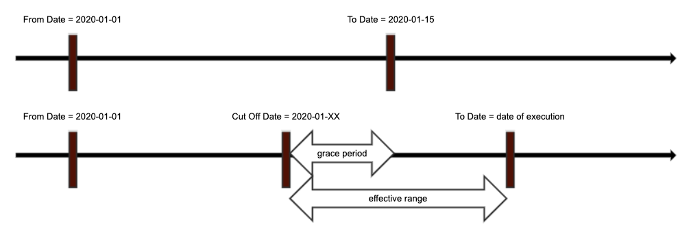
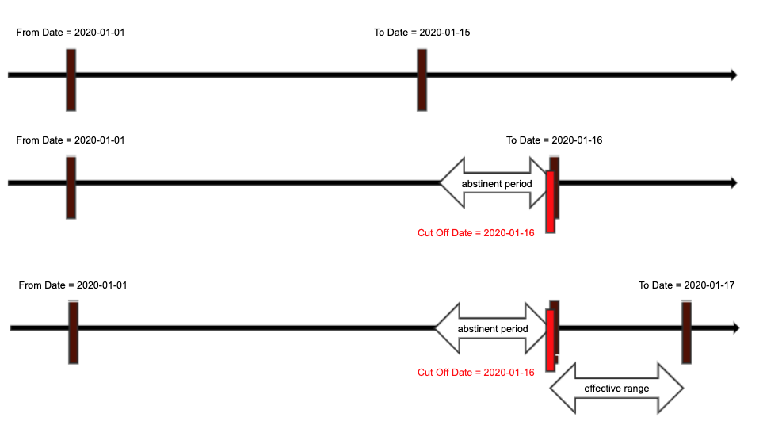

# Watermark

There are two types of watermarks:

- time-based LongWatermark
- unit-based UnitWaterMark. 

## Related
- [ms.watermark](https://github.com/linkedin/data-integration-library/blob/master/docs/parameters/ms.watermark.md)
- [ms.grace.period.days](https://github.com/linkedin/data-integration-library/blob/master/docs/parameters/ms.grace.period.days.md)
- [ms.abstinent.period.days](https://github.com/linkedin/data-integration-library/blob/master/docs/parameters/ms.abstinent.period.days.md)

## Time Watermark

Time watermark defines a time range, with a `from` datetime and a 
`to` datetime. DIL internally handles time watermark values in milliseconds.
For example: 
- `ms.watermark = [{"name": "system","type": "datetime", "range": {"from": "2017-01-02", "to": "-"}}]`

Both the `from` and `to` can take the following configuration format:
- **ISO Datetime**: `yyyy-MM-dd HH:mm:ss.SSSSSSz` or `yyyy-MM-ddTHH:mm:ss.SSSSSSz`
- **ISO 8601 duration**: `PnDTmH`, which is a pattern of "P\\d+D(T\\d+H){0,1}"

When using the ISO 8601 duration format, `n` can be any natural numbers, 
it defines n days before current date time. For example P1D defined 1 day 
before current day. `m` can be any natural number between 0 and 23, 
it defines m hours before the current time. The hour part is optional.
Examples: P0D, P1D, P0DT7H. 

"**-**" (Hyphen) can be used in `to` as a shortcut for "P0DT0H0M".

The `from` datetime is usually static, and `to` datetime is usually dynamic. 
see [ms.watermark](https://github.com/linkedin/data-integration-library/blob/master/docs/parameters/ms.watermark.md). 

A time watermark has an effective range which is defined by an 
`effective cut off date` and watermark `to` date. The `effective 
cut off date` is decided by the last highest watermark, grace period, 
and abstinent period. The formula is:

- `effective cut off date = last highest watermark + abstinent period - grace period`
- `effective cut off date` is the same as `from` if it is the first job execution and last
highest watermark is not established yet

#### Rounding of `to` Datetime

If time watermark is partitioned using multi-day partition (i.e. monthly and weekly), 
the "to date" will be rounded to day level if `to` is `PnD`, and the "to date" will be 
rounded to hour level if `to` is `PnDTmH`.
 
If time watermark is not partitioned or is daily/hourly partitioned, 
the "to date" will include hours and minutes, etc.

### Grace Period

Grace Period addresses the late arrival problem, which is 
very common if the ingestion source is a data warehouse.
See [ms.grace.period.days](https://github.com/linkedin/data-integration-library/blob/master/docs/parameters/ms.grace.period.days.md) 

For example, if we define a time watermark as from **2020-01-01** to **P0D**. Then 
on the first run on 2020-01-15. The effective range is 2020-01-01 to 2020-01-15.  
Then on the next run on 2020-01-16, the effective range will be 2020-01-12 to 
2020-01-16, if we give 3 grace period days and 0 abstinent day. 

See following illustration for a general case over 2 executions:

Therefore, _Grace Period moves effective cut off date back by "GracePeriod" days_, 
increasing the effective range, and thus allow more incremental updates 
be included in the extract.

### Abstinent Period

Abstinent Period has the opposite effect as Grace Period. It addresses the 
repeated download problem. 
See [ms.abstinent.period.days](https://github.com/linkedin/data-integration-library/blob/master/docs/parameters/ms.abstinent.period.days.md)

The repeated download problem, typically in a file download situation, requires
us avoid downloading the downloaded files by X number of days. 

_Abstinent Period moves effective cut off date forward by "AbstinentPeriod" days_, 
reducing or even invalidating effective range, and thus allow few or 
no incremental updates be included in the extract. 

In a file downloading situation, each file is a work unit. Each file has its watermark.
A file will download if the `current date (system)` falls between the effective range. 
 
With the same watermark definition as above, if there is no grace period (for simplicity), 
and there is 1 day abstinent day: 
- on 2020-01-16, the effective range is 0, therefore the file is not downloaded
- on 2020-01-17, the file starts downloading again 

If put in the context that the server provides daily files for the past 7 days, 
we can expect the following behavior if we set Abstinent days to **7 or more**:

- on 2020-01-15, file20200115 is generated, and file20200115 is downloaded

- on 2020-01-16, file20200116 is generated, and file20200116 is downloaded, 
and file20200115 is ignored 

- on 2020-01-17, file20200117 is generated, and file20200117 is downloaded, 
and file20200116 and file20200115 are ignored 

so on, hence no repeated download although the server keeps 7-day's files.
 
If Abstinent days is 0, then on 2020-01-16, the effective range would be 
[2020-01-15, 2020-01-16), and it will repeat downloading file file20200115.

### Cut Off Date

`cut off date` is calculated during runtime. It is based on job configuration
and state store records. `cut off date` is calculated at milliseconds level.  
The `effective cut off date` is the `cut off date` after considering execution history, which 
is tracked in state store. 

- `effective cut off date = last highest watermark + abstinent period - grace period`
- If it is the first job execution and last highest watermark is not present, 
  then `effective cut off date` is the same as `from` 

Each job has an `overall cut off date` and each partition has a `partition cut off date`.

In runtime, the `overall effective cut off date` is calculated by considering all partitions. 
The `overall effective cut off date` is used to decide whether to execute a partition. A partition
executes if its `partition cut off date` is larger than the `overall effective cut off date`. 
A partition without execution history, including when the partition failed in its first execution,
has practically no `partition cut off date`; therefore, it always executes. 
  
### Partitioning

Time watermark can be partitioned into different periods: monthly, weekly, 
daily, and hourly. Parameter [ms.work.unit.partition](https://github.com/linkedin/data-integration-library/blob/master/docs/parameters/ms.work.unit.partition.md)
defines partition method. 

When time watermark is partitioned, it partitions per `from` date and `to` date. 
The `effective cut off date` has no role in defining the partitions. 
This keeps partitions consistent.

#### Multi-day Partitions and Partial Partition 

Monthly and weekly partitions are considered multi-day partitions.
 
Monthly and weekly partitioning can result in a partial partition in the end.
 
For example:

If from date is 2019-01-01, and the to date is "-", and it is 2020-02-21, 
and it is **monthly** partitioned, then the first flow execution will 
have 13 full monthly partitions and 1 partition monthly partition 
from **[2020-02-01, 2020-02-21)**. In the next flow execution, the first 
13 monthly partitions will stay the same, the last partial partition 
becomes **[2020-02-01, 2020-02-22)**. 

If from date is 2020-01-06 (Monday), and the to date is "-", and 
it is 2020-02-21 (Friday), and it is **weekly** partitioned, 
then the last partition will be 2020-02-17 to 2020-02-21.

Partial partition can be disabled by [ms.work.unit.partial.partition](https://github.com/linkedin/data-integration-library/blob/master/docs/parameters/ms.work.unit.partial.partition.md). 

Partitions maintain their own states (high watermark). So, in above 
example, after the first successful flow execution the partition 
[2019-01-01, 2019-01-31) has high watermark as 2019-01-31.
 
A job's effective cut off date is **the largest high watermark of all partitions**. 
Taking above example, after the first successful execution the job's effective cut off date 
will be 2020-02-18 (3 day grace period), because the largest high 
watermark of all partitions is 2020-02-21. 

**_A partition is executed if its end date is larger than the effective cut off date._** 

The job's effective cut off date ensures old partitions will not be 
re-extracted after the first flow execution because older 
partitions' end date is smaller than the job's effective cut off date. 

However, if a partition fails in first execution, its last high watermark will be 
the same as partition start (in milliseconds), and DIL will ignore that in next 
execution. The failed partition will be treated like a new partition.  

When above process is applied to daily partitions, however, the situation 
will appear differently. 

For example, if `from` = "2020-01-01", and `to` = "P0D", 
and it is "daily" partitioned,and it is 2020-02-21, then after the first 
successful execution, each date partition will have a high watermark 
of the midnight of next date (in milliseconds). So the last partition 
2020-02-20 will have high watermark as 2020-02-21 12:00:00 AM. 
Assuming GracePeriod = 3, in next flow execution, 
the job's effective cut off date would be 2020-02-19 12:00:00 AM, 
therefore, partition 02-19, 02-20, and 02-21 will be re-executed 
because their last high watermarks are larger than the job's 
effective cut off date. 

Note: watermark `from` date is allowed to have hours, 
for example 2020-02-21 10:00:00, in such case the partitions 
will also end by that hour, not by 12:00:00 AM. 

- Daily partitions are derived by adding 1 day to `from` date, and so on. 
- Weekly partitions are derived by adding 7 days to `from` date, and so on.
- Monthly partitions are derived by adding 1 month to `from` date, and so on.

## Unit Watermark

A "Unit" watermark holds individual values, like ids. It is a list of string values.   

There are two ways a unit watermark is defined. 

- Explicit definition using [ms.watermark](https://github.com/linkedin/data-integration-library/blob/master/docs/parameters/ms.watermark.md)
- Implicit definition using [ms.secondary.input](https://github.com/linkedin/data-integration-library/blob/master/docs/parameters/ms.secondary.input.md)

A "Unit" watermark can also be defined via ms.watermark explicitly. For example:
- `ms.watermark=[{"name": "surveyId", "type": "unit", "units": "id1,id2,id3"]}]`

Typically, a secondary input provides a list of ids. Those ids will 
be made into unit watermarks internally. For example, in Qualaroo 
configuration, we have:
- `ms.secondary.input=[{"path": "${job.dir}/${preceding.table.name}", "fields": ["id"]}]`

As the input file contains a list of survey ids, that will 
effectively define a unit watermark for each survey id. 

[Back to Summary](summary.md#watermark)