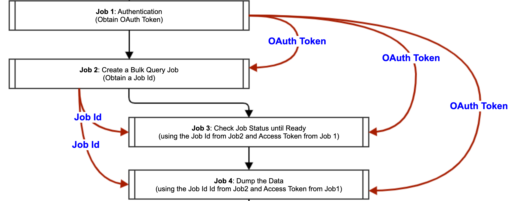

# Asynchronous Ingestion Pattern

Asynchronous ingestion is common on cloud. In an asynchronous ingestion, a request
for data preparation is sent to the provider, and the data requester
can then check back with the provider on status. When the status changes
to ready, the requester can start the data extraction. 

An asynchronous ingestion can have 3, 4, or 5 steps. Different vendors implement
it slightly differently. But at typical implementation would have:

- Start a request for data and retrieve a tracking number like "request id"
- Check status using the request id until it is ready
- Extract the data 

The requester can execute the above process asynchronously because it doesn't 
need to wait for the data once the request is submitted. It can go do other
things, and check status every one a while. As some data providers use
buffers to stage data for extraction, the data preparation process can be 
significant in many cases. So waiting synchronously doesn't make sense
for data extractors. 

## Step 1: Submit a Request

Step 1 is a separate job. So it can also be called Job 1. 

Step 1 has a simple mission which to submit a request and get the Request ID. The Request
ID can come in different forms. It may be just a code, or a URL. Whichever it is, it should
allow the status checking in step 2.    

### Base Configuration

Just like other jobs, the base configurations include source, 
authentication, and others in order to connect to the data provider.

Following are typical settings and explanation:

- `data.publisher.final.dir=<<job_staging_area>>`
- `data.publisher.replace.final.dir=true`
- `writer.file.path.type=namespace_table`

**Explanation**: This job is auxiliary, hence the results are normally not 
persisted into final storage, but you can also make it into
final storage if needed. In above, `data.publisher.replace.final.dir`
and `writer.file.path.type` settings ensure the staging folder
is cleaned up everytime, so that prior responses are not accumulated.    

- `extract.table.type=snapshot_only`
- `state.store.enabled=false`
- `extract.is.full=true`

**Explanation**: For the same reason of being auxiliary, we typically don't want to track incremental
values each time the list is pulled.

### Step-1 Configuration

- `ms.http.request.method=POST`

**Explanation**:  Because this step actual "creates" something one the server, so it is normally a POST 
HTTP request.  

- `ms.output.schema=xxxx`

**Explanation**: The output schema should match the response structure. At high level, Job 1 is 
just a data ingestion job. Only it ingests a small piece of data. Therefore, it should have 
a schema to describe the data. If the response is JSON format, it could be left out, as schema 
can be inferred from JSON data.  

- `ms.derived.fields=xxxx`

**Explanation**: When the Request ID is a sub-part of a response field, you would need to use derived fields
feature to extract out the Request ID. For example, the following extract the numbers after "/syncs/" in the "uri"
field of the response.  
    - `ms.derived.fields=[{"name": "syncid", "formula": {"type": "regexp", "source": "uri", "format": "/syncs/([0-9]+)$"}}]`

- `-extract.table.name=xxxx`

**Explanation**: This is the extracted table name for the request response.  

## Step 2: Check Request Status

See [Status Checking Job](../how-to/status-check-job.md) for additional information. 

Step 2 is a separate job. So it can also be called Job 2. 

Step 2 needs to use session control techniques normally to periodically check status. Too 
frequent checking could overwhelm the server and bust QPS. So it is important to 
manage the pace.      

### Base Configuration

Just like other jobs, the base configurations include source, 
authentication, and others in order to connect to the data provider.

Following are typical settings and explanation:

- `data.publisher.final.dir=<<job_staging_area>>`
- `data.publisher.replace.final.dir=true`
- `writer.file.path.type=namespace_table`

**Explanation**: This job is auxiliary, hence the results are normally not 
persisted into final storage, but you can also make it into
final storage if needed. In above, `data.publisher.replace.final.dir`
and `writer.file.path.type` settings ensure the staging folder
is cleaned up everytime, so that prior responses are not accumulated.    

- `extract.table.type=snapshot_only`
- `state.store.enabled=false`
- `extract.is.full=true`

**Explanation**: For the same reason of being auxiliary, we typically don't want to track incremental
values each time the list is pulled.

### Step-2 Configuration

- `ms.secondary.input=xxxx`

**Explanation**:  this is how you specify the location of job 1 output so that job 2 can read the request
ID from it. For example, the following directs the DIL to read the request ID from the "syncid" field
of the data file under "${job.dir}/${job1.table.name}". The secondary input file from job 1 needs
to be an Avro file.  
-`ms.secondary.input=[{"path": "${job.dir}/${job1.table.name}", "fields": ["syncid"]}]`
See [ms.secondary.input](../parameters/ms.secondary.input.md).

- `ms.call.interval.millis=xxxx`

**Explanation**: This specifies how frequently the DIL should check the status. This should be a proper value that is 
not too small, which could bust QPS, or too big, which could slow down the process. 

- `extract.table.name=xxxx`

**Explanation**: This is the extracted table name for the status checking responses. This table might get multiple records
as each check will write a record to it. 

- `ms.session.key.field=xxxx`

**Explanation**: This is the place to specify when the status is ready, or fail. For example, 
the following looks for a "success" or "ready" value in the "status" field of the response.  
- `ms.session.key.field={"name": "status", "condition": {"regexp": "success|ready"}}`
See [ms.session.key.field](../parameters/ms.session.key.field.md) and [Status Checking Job](../how-to/status-check-job.md).

- `ms.wait.timeout.seconds=xxxx`
  
**Explanation**: This limit the waiting time. The job wait for "timeout" time and fail if the status doesn't
turn to ready after the "timeout" time. This parameter should have a reasonably estimated value based on server 
performance.

## Step 3: Extract Data

Step 3 is a separate job. So it can also be called Job 3. 

### Base Configuration

Just like other jobs, the base configurations include source, 
authentication, and others in order to connect to the data provider.

### Step-3 Configuration

- `data.publisher.final.dir=<<final_data_landing_area>>`

**Explanation**: This is the step to download the data, hence you would save the data in a 
permanent location for subsequent processing. 

- `extract.table.type=snapshot_append`

**Explanation**: Large datasets are normally extracted incrementally so that we don't need to extract
everything every day. But there are also cases where datasets are extracted in full every time. 

- `state.store.enabled=true`

**Explanation**: State store would have to be enabled if data is extracted incrementally. Repeated full
extract would not need state store.  

- `extract.is.full=false`

**Explanation**: This has to be false if data is extracted incrementally. 

- `ms.secondary.input=xxxx`

**Explanation**:  Job 3 normally would also need the request ID from Job 1 to download data. 
This is how you specify the location of job 1 output so that job 3 can read the request
ID from it. For example, the following directs the DIL to read the request ID from the "syncid" field
of the data file under "${job.dir}/${job1.table.name}". The secondary input file from job 1 needs
to be an Avro file.  
-`ms.secondary.input=[{"path": "${job.dir}/${job1.table.name}", "fields": ["syncid"]}]`
See [ms.secondary.input](../parameters/ms.secondary.input.md).

- `extract.table.name=xxxx`

**Explanation**: This is the extracted table name for the final dataset.

## Other Variations

OAuth2 authentication can be used in asynchronous ingestion. In such case, we will have an [authentication
job](../how-to/authentication-job.md) up front.

Then the [secondary input](../parameters/ms.secondary.input.md) would have to include
both the request ID and access token.

See the SFDC bulk API ingestion example:

## Sample Applications

Sample applications of this pattern include:
- [Salesforce (SFDC) bulk API ingestion](../sample-configs/sfdc-bulk-api-ingestion.md)
- [Eloqua API ingestion](../sample-configs/eloqua-api-ingestion.md)
  
[Back to Pattern Summary](summary.md)